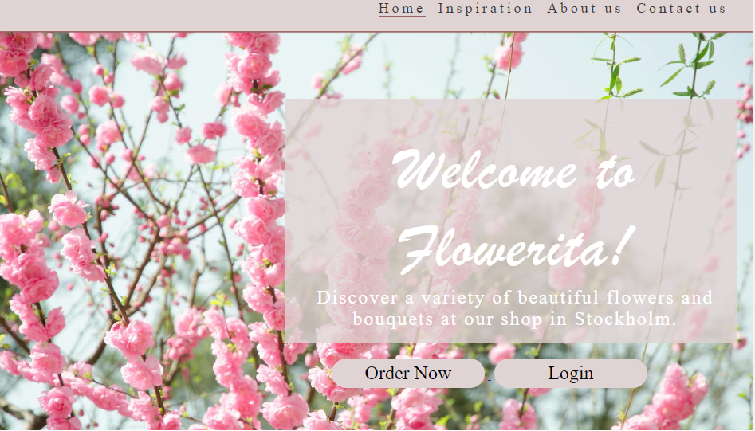

<h1>Flowerita Shop Website</h1>

Flowerita is crafted to be responsive, ensuring visitors can easily access it from various devices. It provides information about the Flowerita shop for all who visit.

 
<a class="text-color" href="https://hebaabdulal.github.io/Flowerita/">Surf the Flowerita Website here</a>

<h2>Features</h2>

<h3>Existing Features</h3>
    <ul>
        <li>
            
<strong>Navigation bar</strong>

            <ul>
                <li>Present on every page, the fully responsive navigation bar features links to the Home page, Inspiration, Login, Signup, and Order page. It remains consistent across all pages, ensuring effortless navigation.
                </li>
                <li>This feature enables users to seamlessly move between pages on any device without needing to rely on the "back" button.
                </li>
                <li>On mobile devices, the navigation links transform into a burger toggler. This change was made to enhance the site's aesthetics and ensure a favorable user experience, as the burger icon is commonly associated with mobile navigation, promoting ease of use for visitors.</li>
            </ul>
        </li>
    </ul>
    

 

     

<ul>
    <li>
        
<strong>Footer</strong>

        <ul>
            <li>
            In the footer section, you'll find links to Flowerita's respective social media platforms. Clicking on these links will open new tabs, facilitating seamless navigation for users. </li>
            <li>
             The footer serves as a valuable tool, encouraging users to stay connected with Flowerita through social media.</li>
        </ul>
    </li>
</ul>

 

<ul>
    <li>
        
<strong>Log In Form</strong>

        <ul>
            <li>This page enables users to sign in to Flowerita's online shop to order their favorite flowers. Users will need to provide their full name and password. Once they've filled out their information, they can proceed to log in or reset the form if needed.
            </li>
        </ul>
    </li>
</ul>

 

<ul>
    <li>
        
<strong>Register Form</strong>

        <ul>
            <li>
            On this page, users can register for Flowerita's online shop to purchase their preferred flowers. They'll need to provide their full name and password, as well as confirm their password to complete the membership process. Once the necessary details are filled in, users can choose to sign up or reset the form accordingly.
            </li>
        </ul>
    </li>
</ul>

 

<ul>
    <li>
        
<strong>Order Form</strong>

        <ul>
            <li>
            This page enables users to place orders for their favorite flowers. Users are prompted to enter their full name, email address, preferred flowers, delivery address, and any additional notes if necessary. After filling out this information, users can proceed to place their order or reset the form if needed.
            </li>
        </ul>
    </li>
</ul>

 

<ul>
    <li>
        
<strong>Contact Us Form</strong>

        <ul>
            <li>
            To receive inquiries from customers, a contact form is necessary. Customers will be prompted to fill in their name, email address, message, and a checkbox to confirm before submitting their inquiry.
            </li>
        </ul>
    </li>
</ul>

 

<h2>Testing</h2>
