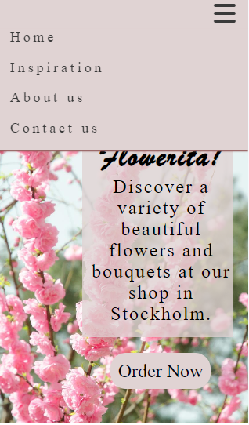

# Flowerita Shop Website

Flowerita is crafted to be responsive, ensuring visitors can easily access it from various devices. It provides information about the Flowerita shop for all who visit.

## Contents

### User Experience (UX)

- __Initial Discussion__
- __User Stories__

### Design

- __Colour Scheme__
- __Typography__
- __Images__
- __Wireframes__
- __Features__
- __Accessibility__

### Technologies Used

- __Languages Used__
- __Frameworks, Libraries and Programs used__

### Deployment
- __Deployment__

### Testing
- __W3C Validator__
- __Navigation Links__
- __Responsive Design__

### Credits

- __Code Used__
- __Media__
- __Content__
- __Acknowledgments__

## User Experience (UX)

- __Initial Discussion__

    Flowerita represents my debut project, crafted with HTML and CSS, offering an online space to exhibit my shop's array of products and diverse flower selections. It also features interactive forms and comprehensive explanations about our website's functionalities.

    #### Important Details About the Website

    - Present selection of flowers.
    - Ordering process guidelines.
    - Contact form for inquiries, questions, and recommendations from customers or visitors.

- __User Stories__
    #### Goals for First-Time Customers:
    - Discover the website's purpose and learn how to place an order.
    - Easily navigate the site to access relevant information.
    - Locate Flowerita's social media profiles.

    #### Goals for Returning Customers:
    - Stay informed about the most recent flower selections.
    - Effortlessly communicate with Flowerita regarding inquiries.

    #### Goals for Frequent Customers:
    - Provide recommendations for the website as a trusted ordering platform.

## Design

### Color Palette 

The color scheme was generated using the Contrast Grid website.

### Typography

#### The fonts for this website were sourced from Google Fonts and Adop Fonts:
    
- Merienda One were chosen for all heading one elements.
- 'Kepler-Med-Capt' in serif style was selected for other headings and body text.

### Images

The images featured on this website were all obtained from www.pexels.com and are free of any copyright issues.

### Wireframes

Wireframes were created for desktop.

## Features

### Existing Features

- __Navigation Bar__

           
    - Present on every page, the fully responsive navigation bar features links to the Home page, Inspiration, About us, Contact us and Order page. It remains consistent across all pages, ensuring effortless navigation.
                
    - This feature enables users to seamlessly move between pages on any device without needing to rely on the "back" button.
                
    - On mobile devices, the navigation links transform into a burger toggler. This change was made to enhance the site's aesthetics and ensure a favorable user experience, as the burger icon is commonly associated with mobile navigation, promoting ease of use for visitors.

- __Footer__

    - In the footer section, you'll find links to Flowerita's respective social media platforms. Clicking on these links will open new tabs, facilitating seamless navigation for users.
           
    - The footer serves as a valuable tool, encouraging users to stay connected with Flowerita through social media.

- __Order Form__
        
    - This page enables users to place orders for their favorite flowers. Users are prompted to enter their full name, email address, preferred flowers, delivery address, and any additional notes if necessary. After filling out this information, users can proceed to place their order or reset the form if needed.
            

- __Contact Us Form__
        
    - To receive inquiries from customers, a contact form is necessary. Customers will be prompted to fill in their name, email address, message, and a checkbox to confirm before submitting their inquiry.
            
## Testing

### Validator Testing

- __HTML__
    - W3C validator

     

    

- __CSS__
    - W3C Validator

     

     

### In order to ensure the functionality and usability of the       website, manual testing was conducted. The following tests were performed:

- __Navigation Links__

| Feature being tested | Expected Outcome | Testing Performed | Actual Outcome | Result (Pass or Fail) |
| -------------------- | ---------------- | ----------------- | -------------- | --------------------- |
| Home Page Link       | Navigate to the home page when clicked | Clicked on the home page link in the navigation bar on every page | Successfully navigated to the home page | Pass |
| Inspiration Page Link| Navigate to the inspiration page when clicked | Clicked on the inspiration page link in the navigation bar on every page | Successfully navigated to the inspiration page | Pass |
| About Us Page Link   | Navigate to the about us page when clicked | Clicked on the about us page link in the navigation bar on every page | Successfully navigated to the about us page | Pass |
| Contact Us Page Link | Navigate to the contact us page when clicked | Clicked on the contact us page link in the navigation bar on every page | Successfully navigated to the contact us page | Pass |

- __Responsive Design__

    The responsiveness of the website was tested using various devices and screen sizes:
    - Desktop: The website displayed correctly and all elements were properly aligned.
    - Tablet: The website adjusted smoothly to the tablet screen size, maintaining readability and usability.
    - Mobile: The website was responsive on mobile devices, with menus and content adjusting appropriately for smaller screens.

## Deployment

- __The website has been deployed to GitHub Pages. Follow these steps to deploy it:__

    - Go to the Settings tab in the GitHub repository.
    
    - In the Source section drop-down menu, choose the Master Branch.
    - Once you've selected the master branch, the page will automatically refresh, showing a detailed ribbon display to confirm the successful deployment.
    - You can access the live link here https://hebaabdulal.github.io/Flowerita/index.html
           
 ## Accessibility

 #### I've taken care to make the website user-friendly throughout the coding process:

 - Employing semantic HTML for enhanced accessibility.
 - Including descriptive alt attributes for all images on the site.
 - Offering information for screen readers where icons are used without accompanying text, such as book review ratings and footer icons.
 - Ensuring adequate color contrast across the site.
 - Making menus accessible by indicating the current page for screen readers.

 

 #### Future Implementations

 - Implement a JavaScript function to enable the "return to top" feature on the website.

 ## Languages Used

 - HTML
 - CSS

 ## Frameworks, Libraries and Program used

 - Gitpod was used for version control
 - GitHub was used for to save the files for the website
 - Balsamiq was used to create wireframes
 - Google Fonts, Adop Fonts was used to import the fonts used on the website
 - Font Awesome icons were utilized for the iconography across the website.
 - Google Dev Tools were employed to troubleshoot, test features, and address responsiveness and styling issues.
 - Am I Responsive? To display the website image across various devices.
 - Tiny PNG To compress images.
 - www.favicon.io To create favicon.

## Credits

### Code Used

- HTML
- CSS

### Media

- The website incorporated images, logos, and visuals sourced from www.pexels.com, was utilized during development. The Google Chrome browser was used for testing and previewing.

### Content

- Content for the website is written by the owner of Interflora translated from Swedish to English.

### Acknowledgments

A special thanks goes out to those who provided support during the completion of my first milestone project: Matt Bodden, my Code Institute Mentor.
